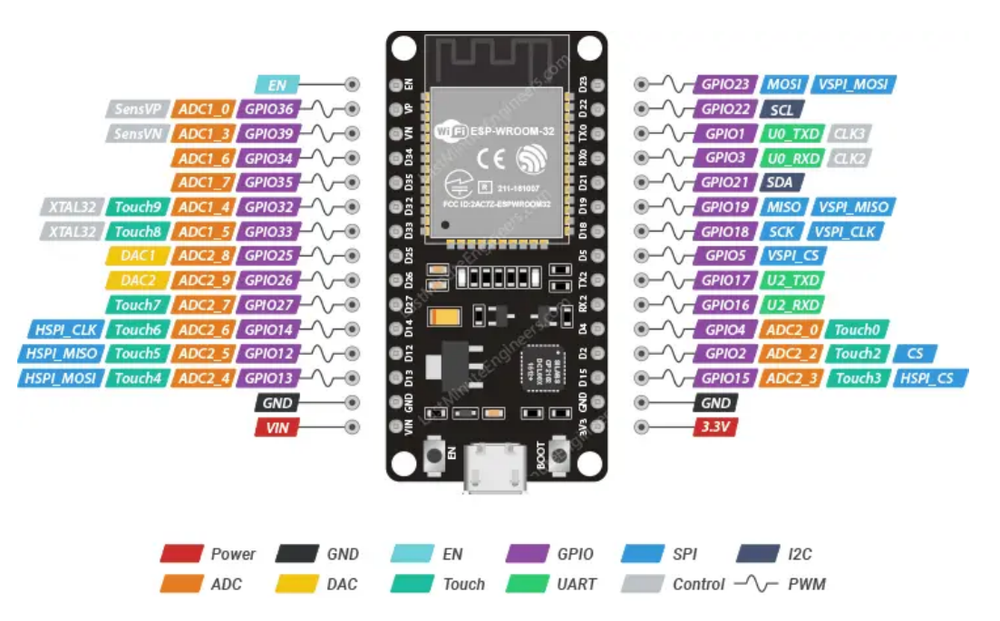

## Humidor

The premise of this project is to build my own humidor notification system for a cigar box.

### Why do this?

1. I like cigars and want to be able to store a small collection at my house.
2. This would be a great way to get my hands back into hobbyist electronics and _inventing_.
3. I'll be able to _implement creativity_ with novel solutions to a problem and _acquisition of knowledge_.
4. I'll (re)learn the basics of working with microcontrollers, sensors, wiring, soldering, prototyping, and (perhaps) IoT.

### Deliverables

A circuit using an ESP32 with capabilities to:

- read sensor output
- send an alert over wifi for when humidity is too low/high
- send an alert over wifi for low battery/power
- A flask backend for relaying the sensor data to a discord bot
- runs on battery power (1 18650 battery) and lasts > 1 week until needing recharge

### Wiring Schematics

- Pinout Diagram for the esp I used (ESP-WROOM-32)
  

- Wiring Diagram

- Required electronic pieces
  - ESP-WROOM-32
  - SHT30X/SHT31-D/SHT31 humidity sensor
  -

### Getting Started with Flask & Waitress

- Install requirements using a venv

```bash
pip install -r requirements.txt
```

- your raspi environment needs to have these variables exported

```bash
HUMIDOR_DISCORD_WEBHOOK="your_webhook"
```

- run the server on port `5001` with

```
python -m raspi.backend
```

- you will also need a _secrets.h_ file in the `./phase2` folder with these variables, then flash `phase2.ino` onto your esp-32

```
// env vars for wifi network
const char* ssid = "yourwifinetwork";
const char* password = "wifipassword";

const char* endpoint = "http://yourraspiip:yourport/humidor";
```

#### ad hoc notes

I2C is a communication protocol used to connect sensors and peripherals to microcontrollers

Serial Data (SDA) The data line — sends/receives data between the microcontroller and sensor

Serial Clock (SCL) The clock line — keeps everything in sync by pulsing with timing signals
